# VOICE_AGENT: Multilingual Voice Assistant Platform — Complete Documentation


## Table of Contents
1. [Project Overview](#project-overview)
2. [Key Features](#key-features)
3. [Architecture Deep Dive](#architecture-deep-dive)
   - [System Architecture](#system-architecture)
   - [Audio Pipeline](#audio-pipeline)
   - [Conversation Flow](#conversation-flow)
   - [Barge-in Optimization](#barge-in-optimization)
4. [Quickstart Guide](#quickstart-guide)
   - [Prerequisites](#prerequisites)
   - [Local Setup](#local-setup)
   - [Docker Setup](#docker-setup)
5. [Configuration Reference](#configuration-reference)
   - [Environment Variables](#environment-variables)
   - [VoiceRuntimeConfig](#voiceruntimeconfig)
6. [Multilingual Support](#multilingual-support)
   - [Language Detection & Script Gate](#language-detection--script-gate)
   - [Romanized Text Handling](#romanized-text-handling)
   - [TTS Normalization](#tts-normalization)
7. [Provider Ecosystem](#provider-ecosystem)
8. [Deployment Guide](#deployment-guide)
9. [Logging & Telemetry](#logging--telemetry)
10. [API Reference](#api-reference)
11. [Troubleshooting](#troubleshooting)
12. [License](#license)

---

## Project Overview

VOICE_AGENT is a production-ready, multilingual voice assistant platform designed for enterprise IT support scenarios. Built on LiveKit WebRTC infrastructure with real-time streaming architecture, it delivers natural voice conversations with sub-second latency across Bengali, Hindi, and English.

**Core Capabilities:**
- 🗣️ Real-time voice conversations with human-like latency (<500ms end-to-end)
- 🌐 Native multilingual support (Bengali/Hindi/English) with script-based language detection
- ⚡ Barge-in optimized architecture (user can interrupt agent speech instantly)
- 🧠 Context-aware conversation with knowledge base retrieval and resolved-issue detection
- 📊 Production-grade logging with transcript storage and telemetry
- 🔌 Pluggable provider architecture (LLM, STT, TTS, Vector DB)

**Target Use Cases:**
- IT helpdesk automation for multilingual enterprises
- Voice-based troubleshooting with step-by-step guidance
- Asset management support (lost/damaged device workflows)
- Policy lookup and HR/IT process guidance

---

## Key Features

### ✅ Multilingual Voice Conversations
- **Script-based language detection**: Automatically identifies Bengali (বাংলা), Hindi (हिंदी), and English based on Unicode character ranges
- **Romanized text handling**: Intelligently processes romanized Bengali/Hindi ("amar laptop harie geche") → canonical English query for KB retrieval
- **Language-consistent responses**: Maintains language continuity throughout conversation with proper tone/phrasing per language
- **Bengali corporate style**: Preserves English IT terms (policy, TMS, Wi-Fi) within Bengali responses for natural corporate communication

### ⚡ Barge-in Optimization
Three-layer barge-in detection for instant interruption:
1. **Transcript-based**: Cancel LLM/TTS when STT detects new user speech
2. **Audio RMS-based**: Detect speech onset via audio energy (configurable threshold)
3. **VAD-enhanced**: Silero VAD for precise speech/silence boundary detection

**Critical Configurations:**
```python
TTS_PUBLISH_BUFFER_MS=400  # Reduced buffer for faster barge-in response
STT_BARGE_IN_COOLDOWN_MS=650  # Prevent rapid cancellation thrashing
STT_RMS_SPEECH_THRESHOLD=500  # Audio energy threshold for speech detection
```

### 🧠 Conversation Intelligence
- **Resolved-issue detection**: Automatically ends calls when user says "now working/kaj korche/ab kaam kar raha hai"
- **Intent-aware responses**: Greetings, closings, and low-intent utterances handled without KB/LLM overhead
- **Knowledge base caching**: Two-layer cache (Redis exact + Supabase semantic) with intent-scoped matching
- **Step-by-step troubleshooting**: Interactive checklist guidance with stateful progression tracking

### 🔒 Production Hardening
- **Script gate**: Filters unsupported scripts before LLM processing (`lang_gate.py`)
- **Deadlock prevention**: PCM queue drops oldest chunks when full to maintain real-time flow (`stt_pump.py`)
- **Cancellation safety**: Proper asyncio cancellation propagation across LLM/TTS pipelines
- **Session isolation**: Per-session transcript logging with PID-aware filenames

---

## Architecture Deep Dive

### System Architecture
```
User Browser/Mobile
       │
       ▼
┌───────────────────────┐
│  LiveKit Client SDK   │ ← WebRTC Audio Stream
└───────────┬───────────┘
            │ WebSocket
            ▼
┌───────────────────────┐
│  LiveKit Server       │ ← Room Management
└───────────┬───────────┘
            │ gRPC
            ▼
┌───────────────────────┐
│ Voice Agent Worker    │ ← agent_runtime_voice_in_stt.py
│ (Python Async)        │
└───────────┬───────────┘
            │
    ┌───────┼───────┐
    ▼       ▼       ▼
┌────────┐┌────────┐┌────────┐
│ STT    ││ LLM    ││ TTS    │
│ Sarvam ││ Gemini ││ Sarvam │
└────────┘└────────┘└────────┘
    │       │       │
    ▼       ▼       ▼
┌───────────────────────┐
│ Supabase Vector DB    │ ← Knowledge Base + Semantic Cache
└───────────────────────┘
```

### Audio Pipeline
**Critical Path:** `40ms STT chunks → 20ms LiveKit frames`

```python
# Audio conversion flow (audio_utils.py)
Raw PCM (any format)
  ↓ to_16k_mono_int16()
16kHz Mono S16LE (standardized)
  ↓ chunk_40ms()
40ms chunks (640 bytes) → Sarvam STT
  ↓ pcm_frames_20ms()
20ms frames (320 bytes) → LiveKit AudioSource
```

**Key Parameters:**
| Parameter | Value | Purpose |
|-----------|-------|---------|
| `TARGET_SR` | 16000 Hz | Standard speech processing sample rate |
| `STT_CHUNK_MS` | 40ms | Optimal Sarvam STT chunk size |
| `CHUNK_MS` | 20ms | LiveKit audio frame requirement |
| `TTS_PUBLISH_BUFFER_MS` | 400ms | Barge-in responsiveness tuning |

### Conversation Flow

```mermaid
sequenceDiagram
    participant U as User
    participant A as Agent
    participant S as STT
    participant L as LLM
    participant K as KB
    
    U->>A: Speaks "My laptop not working"
    A->>S: Audio stream (40ms chunks)
    S->>A: "My laptop not working" (finalized)
    A->>K: Embed query → Retrieve docs
    K->>A: Relevant IT policy snippets
    A->>L: Prompt with context + history
    L->>A: Streaming response tokens
    A->>TTS: Sentence chunks → Audio synthesis
    TTS->>A: PCM audio frames (20ms)
    A->>U: "দুঃখিত শুনে — আমরা এখনই সমাধান করব।<br>প্রথমে চেক করুন যে ল্যাপটপ চার্জার সংযুক্ত আছে কিনা..."
    
    Note over U,A: User interrupts during TTS
    U->>A: "Wait, it's working now!"
    A->>TTS: Cancel current synthesis
    A->>L: Cancel ongoing generation
    A->>A: Detect resolved-issue intent
    A->>U: "দারুণ — এখন কাজ করছে শুনে ভালো লাগল। ভালো থাকবেন।"
    A->>A: Set should_end_call=True
```


### Barge-in Optimization Strategies
Three complementary techniques working in concert:

1. **TTS Buffer Tuning** (`tts_pipeline.py`)
   ```python
   # Configurable publish buffer (default 400ms → 120ms for ultra-responsive)
   publish_target_ms = max(120, min(2000, cfg.TTS_PUBLISH_BUFFER_MS))
   ```
   Smaller buffers = faster interruption but potentially choppier audio

2. **Transcript-Based Cancellation** (`stt_pump.py`)
   ```python
   if cfg.ENABLE_BARGE_IN and user_starts_speaking:
       cancel_inflight("user speaking (barge-in)")
   ```

3. **Audio RMS Detection** (`websocket_stt.py`)
   ```python
   if rms_int16(audio_chunk) >= SPEECH_RMS_THRESHOLD:
       speech_hits += 1
       if speech_hits >= SPEECH_CONSEC_CHUNKS_TO_TRIGGER:
           cancel_tts("barge_in_speech")
   ```

---

## Quickstart Guide

### Prerequisites
- Python 3.10+
- Docker & Docker Compose
- LiveKit Server (cloud or self-hosted)
- API Keys:
  - `GEMINI_API_KEY` (LLM + embeddings)
  - `SARVAM_API_KEY` (STT + TTS)
  - `SUPABASE_URL` + `SUPABASE_SERVICE_ROLE_KEY` (Knowledge Base)

### Local Setup
```bash
# 1. Clone repository
git clone https://github.com/your-org/voice_agent.git
cd voice_agent

# 2. Create .env file (see .env.example template)
cp backend/.env.example backend/.env
# Edit with your API keys and LiveKit credentials

# 3. Install dependencies
pip install -r requirements.txt

# 4. Start LiveKit agent worker
python backend/app/agent/agent_runtime_voice_in_stt.py

# 5. Start FastAPI server (separate terminal)
uvicorn backend.main:app --reload --port 8000
```

### Docker Setup
```bash
# Development environment (with hot-reload)
docker-compose up --build

# Production environment
docker-compose -f docker-compose.prod.yml up -d
```

**Key Services:**
| Service | Port | Purpose |
|---------|------|---------|
| `fastapi` | 8000 | API server (WebSocket STT, provider APIs) |
| `livekit-agent` | - | Voice agent worker (connects to LiveKit server) |
| `redis` | 6379 | Conversation memory cache |
| `minio` | 9000 | Document/blob storage |
| `supabase` | 5432 | Vector database (PostgreSQL + pgvector) |

---

## Configuration Reference

### Environment Variables
**Critical Runtime Settings (`backend/.env`):**
```ini
# Audio Pipeline
TARGET_SR=16000
CHUNK_MS=20
STT_CHUNK_MS=40

# Barge-in Tuning
ENABLE_BARGE_IN=true
TTS_PUBLISH_BUFFER_MS=400
STT_BARGE_IN_COOLDOWN_MS=650

# Utterance Finalization
UTTERANCE_SILENCE_MS=900
MIN_UTTERANCE_CHARS=18
MIN_UTTERANCE_WORDS=5
FAST_FINAL_ENABLED=true

# Knowledge Base
KB_TENANT=IT
KB_POLICY_VERSION=v1
KB_TOP_K=5
KB_MIN_SIMILARITY=0.35

# Providers
GEMINI_API_KEY=your_key_here
SARVAM_API_KEY=your_key_here
SUPABASE_URL=https://your-project.supabase.co
SUPABASE_SERVICE_ROLE_KEY=your_key_here
LIVEKIT_URL=wss://your-domain.livekit.cloud
LIVEKIT_API_KEY=your_key
LIVEKIT_API_SECRET=your_secret
```

### VoiceRuntimeConfig (`config_voice_runtime.py`)
Immutable configuration container with 30+ tunable parameters:

| Category | Parameters | Purpose |
|----------|------------|---------|
| **Audio** | `TARGET_SR`, `TARGET_CH`, `CHUNK_MS` | Core audio format specifications |
| **Utterance** | `UTTERANCE_SILENCE_MS`, `MIN_UTTERANCE_CHARS` | Speech segmentation heuristics |
| **Barge-in** | `TTS_PUBLISH_BUFFER_MS`, `ENABLE_BARGE_IN` | Interruption responsiveness |
| **TTS Streaming** | `TTS_STREAM_CHUNK_CHARS`, `TTS_STREAM_FORCE_CHARS` | Early speech initiation |
| **VAD** | `STT_SILERO_SPEECH_PROB`, `STT_VAD_END_SILENCE_MS` | Voice activity detection |
| **Cache** | `CACHE_TENANT`, `CACHE_POLICY_VERSION` | Knowledge base caching scope |

**Runtime Initialization:**
```python
from app.agent.config_voice_runtime import load_voice_runtime_config

cfg = load_voice_runtime_config()  # Reads all env vars automatically
print(f"Silence timeout: {cfg.UTTERANCE_SILENCE_MS}ms")
```

---

## Multilingual Support

### Language Detection & Script Gate
**Three-tier detection strategy (`lang_gate.py`):**

1. **Script Analysis** (Unicode ranges):
   - Bengali: U+0980–U+09FF → `bn-IN`
   - Devanagari: U+0900–U+097F → `hi-IN`
   - Latin: U+0041–U+007A → `en-IN`

2. **Confidence Thresholds**:
   ```python
   if bn >= 4 and bn > hi and bn >= lat: return "bn-IN"
   if hi >= 4 and hi > bn and hi >= lat: return "hi-IN"
   if lat >= 6 and lat > bn and lat > hi: return "en-IN"
   ```

3. **Script Gate** (`stt_pump.py`):
   ```python
   if ENABLE_SCRIPT_GATE:
       guessed = guess_lang_script_gate(text)
       if guessed == "REJECT":
           print(f"🚫 Blocked unsupported script: '{text[:120]}'")
           continue  # Skip invalid text
   ```

### Romanized Text Handling
Critical for Bengali/Hindi users typing in English script:

```python
# Example: "amar laptop harie geche" → "i have lost my laptop"
def _canonical_retrieval_query_romanized(text, language):
    # Detect romanized Bengali/Hindi patterns
    if "hariye" in text.lower() and "laptop" in text.lower():
        return "i have lost my laptop what should i do"
    
    # Apply language-specific canonicalization rules
    # ...
```

**Why this matters:** Embedding "amar laptop harie geche" has low similarity to English KB entries. Canonicalization bridges this gap.

### TTS Normalization (`tts_text.py`)
Language-specific acronym expansion for natural pronunciation:

| Language | Input | Output |
|----------|-------|--------|
| Bengali | "TMS issue" | "টিকিট ম্যানেজমেন্ট সিস্টেম (টিএমএস) issue" |
| Hindi | "TMS issue" | "टिकट मैनेजमेंट सिस्टम (टीएमएस) issue" |
| English | "TMS issue" | "T M S issue" |

---

## Provider Ecosystem

### Core Providers
| Provider | Implementation | Purpose |
|----------|----------------|---------|
| **LLM** | `gemini_provider.py` | Streaming text generation with cancellation support |
| **Embeddings** | `gemini_embeddings.py` | 768-dim vectors (L2 normalized) for Supabase compatibility |
| **STT** | `sarvam_streaming.py` | Real-time streaming STT with VAD and language switching |
| **TTS** | `sarvam_tts.py` | Streaming TTS with early speech initiation (PCM 16kHz mono) |
| **Vector DB** | `supabase.py` | Two-layer cache (Redis exact + Supabase semantic) |
| **Memory** | `memory_manager.py` | Redis-backed conversation history with retention policy |
| **VAD** | `silero_VAD.py` | Streaming voice activity detection with utterance segmentation |

### Factory Pattern
All providers accessed via `app.providers.factory` for hot-swapping:
```python
llm = get_llm_provider("gemini")
kb = get_vector_db_provider("supabase")
tts = get_tts_provider("sarvam")
```

---

## Deployment Guide

### Development Environment (`docker-compose.yml`)
```yaml
services:
  fastapi:
    build: .
    ports: ["8000:8000"]
    volumes: ["./backend:/app/backend"]  # Hot-reload enabled
    env_file: backend/.env

  livekit-agent:
    build: .
    command: python backend/app/agent/agent_runtime_voice_in_stt.py
    env_file: backend/.env
    # No ports exposed (connects outbound to LiveKit server)
```

### Production Environment (`docker-compose.prod.yml`)
```yaml
services:
  fastapi:
    build:
      context: .
      dockerfile: Dockerfile.prod  # Multi-stage build
    ports: ["8000:8000"]
    restart: unless-stopped
    healthcheck:
      test: ["CMD", "curl", "-f", "http://localhost:8000/health"]
      interval: 30s
      timeout: 10s
      retries: 3

  livekit-agent:
    build:
      context: .
      dockerfile: Dockerfile.prod
    command: python backend/app/agent/agent_runtime_voice_in_stt.py
    restart: unless-stopped
    # Production optimizations:
    # - No volume mounts (immutable containers)
    # - Resource limits (CPU/memory)
    # - Health checks
```

### Makefile Targets
```makefile
# Development
dev: build
	docker-compose up

# Production
prod: build-prod
	docker-compose -f docker-compose.prod.yml up -d

# Testing
test-agent:
	python backend/app/agent/agent_runtime_min.py

# Logs
logs-agent:
	docker-compose logs -f livekit-agent

# Cleanup
clean:
	docker-compose down -v
	rm -rf backend/logs backend/system_logs
```

---

## Logging & Telemetry

### Transcript Logging (`transcript_logger.py`)
- **Location**: `backend/app/logs/transcript/`
- **Format**: `[YYYY-mm-dd HH:MM:SS] role: utterance text`
- **Session isolation**: Filename includes session ID + PID + timestamp
- **Thread-safe**: Locking for concurrent writes

### System Log Capture (`system_log_capture.py`)
- **Location**: `backend/system_logs/`
- **Mechanism**: Tee-stream duplicates stdout/stderr to log file + console
- **PID-aware**: Separate files per process for multi-worker deployments
- **Early initialization**: Call before imports to capture all logs

### Telemetry Console (`telemetry_console.py`)
Real-time console output modes (configurable via `VoiceRuntimeConfig`):
| Mode | Config Flag | Purpose |
|------|-------------|---------|
| Rolling STT | `SHOW_LIVE_TRANSCRIPT` | Single-line real-time STT display |
| Final utterances | `print_final_transcript()` | User utterance logging |
| TTS playback | `SHOW_TTS_TRANSCRIPT` | Agent response logging |
| Template markers | `print_template_answer()` | Cache hits/greetings/thinking |

---

## API Reference

### Voice Session Management (`livekit_voice.py`)
```http
POST /api/v1/voice/sessions
Content-Type: application/json

{
  "agent_name": "sampurna-voice-agent",
  "identity": "user_123"
}
```
**Response:**
```json
{
  "session_id": "room_xyz:user_123",
  "room_name": "room_xyz",
  "identity": "user_123",
  "livekit_url": "wss://your-domain.livekit.cloud",
  "token": "eyJhbGciOiJIUzI1NiIsInR5cCI6IkpXVCJ9...",
  "agent_name": "sampurna-voice-agent"
}
```

### Provider Selection (`providers.py`)
```http
POST /api/v1/providers/selection
Content-Type: application/json

{
  "session_id": "session_abc123",
  "llm": "gemini",
  "vector_db": "supabase",
  "stt": "sarvam"
}
```

### Blob Upload (`blob_upload.py`)
Two upload modes:
1. **Pre-signed URL** (large files): `/api/v1/upload/prepare` → client uploads directly to MinIO
2. **Direct upload** (small files): `/api/v1/upload/direct` → multipart form upload through API

---

## Troubleshooting

### Common Issues & Solutions

| Symptom | Likely Cause | Solution |
|---------|--------------|----------|
| **Silence after first utterance** | STT queue deadlock | Verify `STT_PCM_QUEUE_MAX` ≥ 60; check Sarvam API key validity |
| **Barge-in not working** | TTS buffer too large | Reduce `TTS_PUBLISH_BUFFER_MS` to 120-200ms |
| **Language switching failures** | Script gate too strict | Disable `STT_ENABLE_SCRIPT_GATE` temporarily for debugging |
| **Redis cache misses** | Unicode normalization issues | Enable `L1_DEBUG=true` to inspect normalized keys |
| **"No remote audio track"** | LiveKit SDK version mismatch | Verify SDK compatibility; check participant identity propagation |
| **Supabase 768-dim errors** | Wrong embedding dimension | Ensure `google.genai` SDK (not old `google.generativeai`) for 768-dim output |

### Performance Tuning
```ini
# Faster barge-in (tradeoff: slightly choppier audio)
TTS_PUBLISH_BUFFER_MS=150

# More aggressive utterance finalization
UTTERANCE_SILENCE_MS=600
EXTRA_GRACE_MS=200

# Reduce KB retrieval latency
KB_TOP_K=3
KB_MIN_SIMILARITY=0.40

# Increase STT responsiveness
STT_BARGE_IN_COOLDOWN_MS=400
```

### Debugging Workflow
```bash
# 1. Enable verbose logging
export SHOW_LIVE_TRANSCRIPT=true
export SHOW_STT_CHUNKS=true
export SHOW_TTS_TRANSCRIPT=true
export L1_DEBUG=true

# 2. Start agent with system log capture
python backend/app/agent/agent_runtime_voice_in_stt.py

# 3. Monitor logs in real-time
tail -f backend/system_logs/voice_agent__pid*.log
tail -f backend/app/logs/transcript/*.log
```

---

## License

This project is licensed under the **Sampurna License** (`sampurna_license.md`) with commercial usage terms. Core dependencies use their respective licenses:

- LiveKit Agents: Apache 2.0
- Sarvam AI SDK: Proprietary (API terms apply)
- Gemini/Google AI: Google AI Terms of Service
- Supabase/pgvector: MIT + PostgreSQL License

For license compliance questions, contact legal@sampurna.co.in.

---

*Documentation generated on Wednesday, February 11, 2026*  
*VOICE_AGENT v1.0.0 — Production Voice Assistant Platform*
